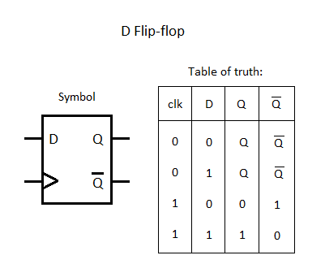

# verification-of-dff
Design Verification of a D Flipflop

Data flip flop is a common circuit in almost all digital systems. D FFs follow whatever data we have on the data bus when we have a valid clock edge.

The declaration of all the ports present in a D FF are done using an interface.

Ports: 
1. Clock -> synchronizing signal
2. Reset -> assumed a synchronous reset 
3. Din, Dout -> input and ouput ports

To build the verification environment we utilize a transaction class, generator class, driver class, monitor class and a scoreboard class.

-> Transaction class holds the data members for all the input and output ports present in the design. Generator class uses a mailbox to send the stimuli to the driver class which would access the interface and apply to the DUT. Generator also sends the golden data to the scoreboard utilizing a mailbox. Monitor captures the respone of the DUT with the help of interface and sends it to the scorebaord using a mailbox. Scoreboard compares this data with the generator data and if the data matches, we would be sending a test pass message.

-> Environment class will be used to hold all the components together. Transaction is a dynamic component and is used to create an object of a class to store data values. Generator, driver, scoreboard and monitor are static components that stay for the entire duration of a simulation. Therefore environment is used to hold all the static componenets together while transaction as and when we require, would be creating an object of it. 